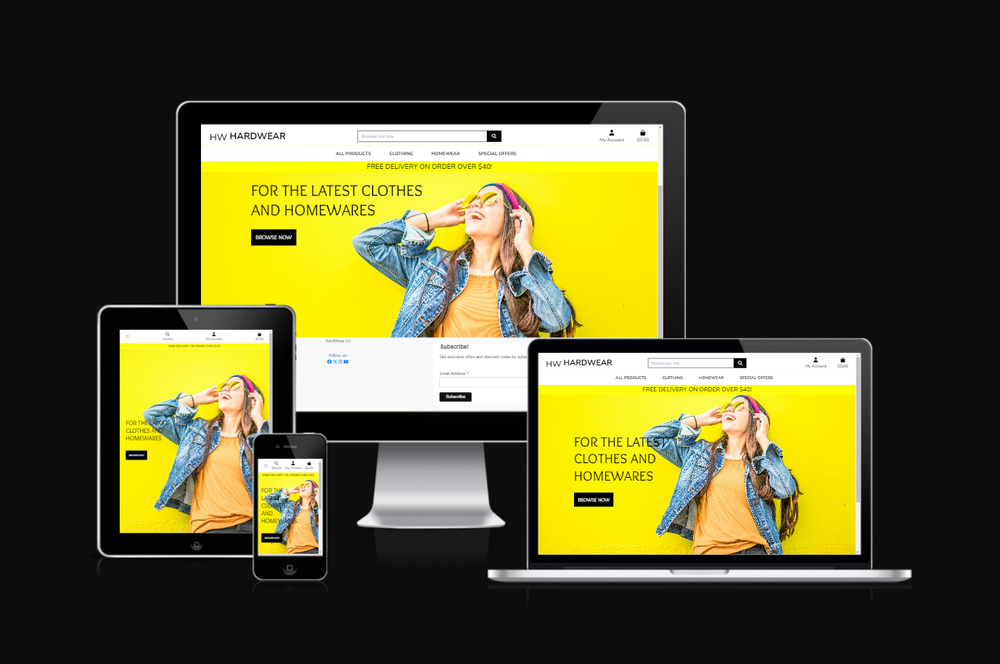
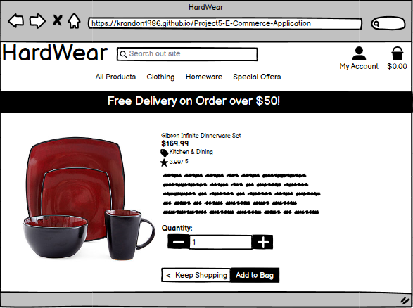
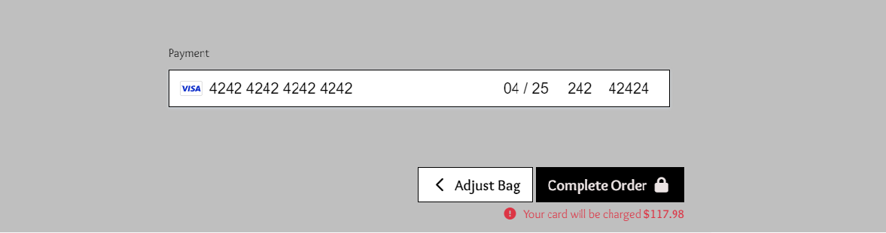
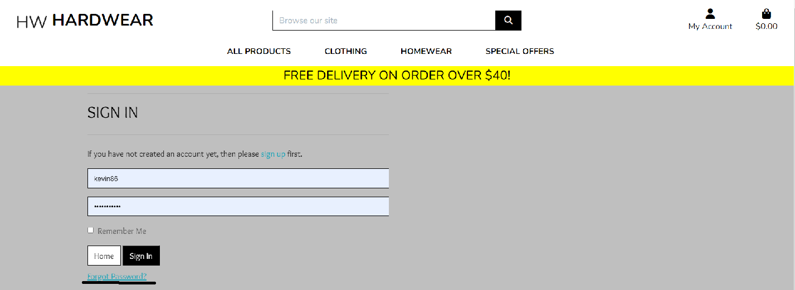
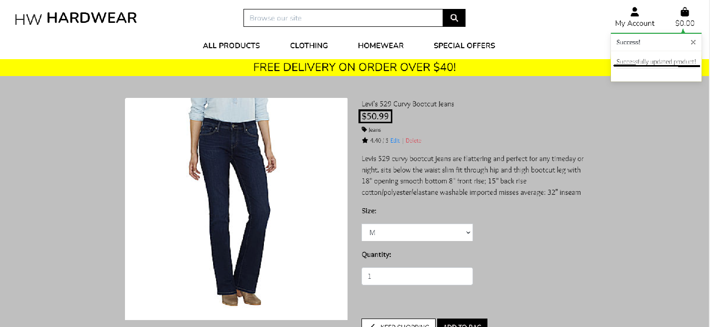

# HardWear

This is my e-commerce site which sells clothes and homeware, such as bed and bath items and kitchen silverware. The name of this site is a play of word with the hardware, but spelt hardwear. Django is what I mainly use to build this site along with a Python back-end development to handle the code that is used to make the site work properly. To make colorful site without having a lot of code in the CSS file, I used the Bootstrap front-end (CSS) framework, along as font awesome to make icons for the checkout and login pages. To be able to allow a credit/debit card transaction via the checkout, Stripe will be connectted to the site with webhooks. 

Visit the live site - [HardWare](https://hardwear-1e19c988931d.herokuapp.com/)

---

---

## **Design**

  - This site will have two main colors, grey and white, with the display banner being yellow. 
  - The navigation and footage sections will be white while the center would be either grey execept for the index page as it have image of smiling woman in front of a yellow wall to match the display banner. 
  - The two main google fonts that I used for this site are Overlock and Nunito as I researched and find out that both fonts work together for a store that sells clothing, which this site partly does. 

Google Fonts:

 

- __Wireframe__

  -  This is the home page of the site.
 

  

  
Home Page:

  
  

  -  This page will contain all the products on the site.

  

  
Products Page:

  
  
 
  
  - This page will have information each product where the user can select a size (if available) and the quanity before adding to bag on the top right of the page.

  

  
Product Info Page:

  
  
 

  - This page will contain the item the user has put in their bag and ready to purchase.

  

  
Bag Page:

  
  
 

  - This page is where the user can checkout their items by filing in the form and enter their payment detail.

  

  
Checkout Page:

  
  
 

  - This is where the user can sign in. 

  

  
Signin page:

  
  
 

  - This is where user can sign up. 

  

  
Signup Page:

  
  
 

### **Database Design**

This site has six database model and the checkout app has two. One is Order and the other is OrderLineItem models

- Order Model:

|Name|Database Key|Field Type|Validation|
|---|---|---|---|
|order_number|order_number|CharField|max_length=32, null=False, editable=False| 
|user_profile|user_profile|ForeignKey|UserProfile, on_delete=models.SET_NULL,null=True, blank=True, related_name='orders'|
|full_name |full_name |CharField|max_length=50, null=False, blank=False|
|email_address |email_address|EmailField|max_length=254, null=False, blank=False|
|phone_number|phone_number|CharField|max_length=20, null=False, blank=False|
|country|country|CountryField|blank_label='Country *', null=False, blank=False|
|postcode|postcode|CharField|max_length=20, null=True, blank=True|
|city_or_town|city_or_town|CharField|max_length=40, null=False, blank=False|
|street_address1|street_address1|CharField|max_length=80, null=False, blank=False|
|street_address2|street_address2|CharField|max_length=80, null=True, blank=True|
|county|county|CharField|max_length=80, null=True, blank=True|
|date|date|DateTimeField|auto_now_add=True|
|delivery_cost|delivery_cost|DecimalField|max_digits=6, decimal_places=2, null=False, default=0|
|order_total|order_total|DecimalField|max_digits=10, decimal_places=2, null=False, default=0|
|grand_total|grand_total|DecimalField|max_digits=10, decimal_places=2, null=False, default=0|
|original_bag|original_bag|TextField|null=False, blank=False, default=''|
|stripe_pid|stripe_pid|CharField|max_length=254, null=False, blank=False, default=''|

- OrderLineItem Model:

|Name|Database Key|Field Type|Validation|
|---|---|---|---|
|order|order|ForeignKey|Orders, null=False, blank=False, on_delete=models.CASCADE, related_name='lineitems'|
|product|product|ForeignKey|Product, null=False, blank=False, on_delete=models.CASCADE|
|product_size|product_size|CharField|max_length=2, null=True, blank=True|
|quantity|quantity|IntegerField|null=False, blank=False, default=0|
|lineitem_total|lineitem_total|DecimalField|max_digits=6, decimal_places=2, null=False, blank=False, editable=False|

- Category Model:

|Name|Database Key|Field Type|Validation|
|---|---|---|---|
|name|name|CharField|max_length=254|
|friendly_name|friendly_name|CharField|max_length=254, null=True, blank=True|

- Product Model:

|Name|Database Key|Field Type|Validation|
|---|---|---|---|
|category|category|ForeignKey|'Category', null=True, blank=True, on_delete=models.SET_NULL|
|sku|sku|CharField|max_length=254, null=True, blank=True|
|name|name|CharField|max_length=254|
|description|description|TextField|   |
|sizes|sizes|BooleanField|default=False, null=True, blank=True|
|price|price|DecimalField|max_digits=6, decimal_places=2|
|rating|rating|rating|DecimalField|max_digits=6, decimal_places=2, null=True, blank=True|
|image_url|image_url|URLField|max_length=1024, null=True, blank=True|
|image|image|ImageField|null=True, blank=True|

- UserProfile Model:

|Name|Database Key|Field Type|Validation|
|---|---|---|---|
|user|user|OneToOneField|User, on_delete=models.CASCADE|
|default_phone_number|default_phone_number|CharField|max_length=20, null=True, blank=True|
|default_street_address1|default_street_address1|CharField| max_length=80, null=True, blank=True|
|default_street_address2|default_street_address2|CharField|max_length=80, null=True, blank=True|
|default_city_or_town|default_city_or_town|CharField|max_length=40, null=True, blank=True|
|default_county|default_county|CharField|max_length=80, null=True, blank=True|
|default_postcode|default_postcode|CharField|max_length=20, null=True, blank=True|
|default_country|default_country|CountryField| blank_label='Country', null=True, blank=True|

## **User Stories**

These user stories were developed for the project using Agile development methodology.
To see the full list, click [here.](https://github.com/users/krandon1986/projects/7/views/1 "Link to HardWear Project" ) to User Story Project. 

#### **Shopper**
* [User Story # 1](https://github.com/krandon1986/project-5-e-commerce-application/issues/1) 
    
  

  
View Product

    
    
 
     

* [User Story # 2](https://github.com/krandon1986/project-5-e-commerce-application/issues/2)
    
    

    
Special Deals or Offer

    
    

     

* [User Story #3](https://github.com/krandon1986/project-5-e-commerce-application/issues/3)

    

    
View Purchase Total

    
    

     
  
* [User Story #9](https://github.com/krandon1986/project-5-e-commerce-application/issues/9)
    
    

    
Sorting List of Products

    
    

     

* [User Story # 10](https://github.com/krandon1986/project-5-e-commerce-application/issues/10)
    
    

    
Sorting a Specific Category

    
    

     

* [User Story # 11](https://github.com/krandon1986/project-5-e-commerce-application/issues/11)
    
    

    
Sorting Multiple Product Categories

    
    

     

* [User Story # 12](https://github.com/krandon1986/project-5-e-commerce-application/issues/12)
    
    

    
Product by Name and Description

    
    
    

     

* [User Story # 13](https://github.com/krandon1986/project-5-e-commerce-application/issues/13)
    
    

    
Previous Search Result

    
    

     

* [User Story # 14](https://github.com/krandon1986/project-5-e-commerce-application/issues/14)
    
    

    
Product's Size and Quantity

    
    

     

* [User Story # 15](https://github.com/krandon1986/project-5-e-commerce-application/issues/15)
    
    

    
Viewing Items

    
    

     

* [User Story # 16](https://github.com/krandon1986/project-5-e-commerce-application/issues/16)
    
    

    
Product Quantity Adjustment

    
    

     

* [User Story # 17](https://github.com/krandon1986/project-5-e-commerce-application/issues/17)
    
    

    
User Payment Information

    
    

     

* [User Story # 18](https://github.com/krandon1986/project-5-e-commerce-application/issues/18)
    
    

    
User Personal and Payment Confidentiality

    
    

     

* [User Story # 19](https://github.com/krandon1986/project-5-e-commerce-application/issues/19)
    
    

    
Order Confirmation

    
    
    

     

#### **Site User**
* [User Story # 4](https://github.com/krandon1986/project-5-e-commerce-application/issues/4) 
    
  

  
Account Registration

    
    
    
    
    
    
 
     

* [User Story # 5](https://github.com/krandon1986/project-5-e-commerce-application/issues/5)
    
    

    
Login/Logout

    
    
    

     

* [User Story # 6](https://github.com/krandon1986/project-5-e-commerce-application/issues/6)
    
    

    
Password Recovery

    
    
    

     

    

#### **Admin/Store Owner**
* [User Story # 20](https://github.com/krandon1986/project-5-e-commerce-application/issues/20) 
    
    

    
Add a Product

    
    

     

    

    
Edit a Product

    
    
    
    

     

    

    
Delete a Product

    
    
    

     

  

To log into the Heroku toolbelt CLI:

1. Log in to your Heroku account and go to *Account Settings* in the menu under your avatar.
2. Scroll down to the *API Key* and click *Reveal*
3. Copy the key
4. In Gitpod, from the terminal, run `heroku_config`
5. Paste in your API key when asked

You can now use the `heroku` CLI program - try running `heroku apps` to confirm it works. This API key is unique and private to you, so do not share it. If you accidentally make it public, you can create a new one with _Regenerate API Key_.

